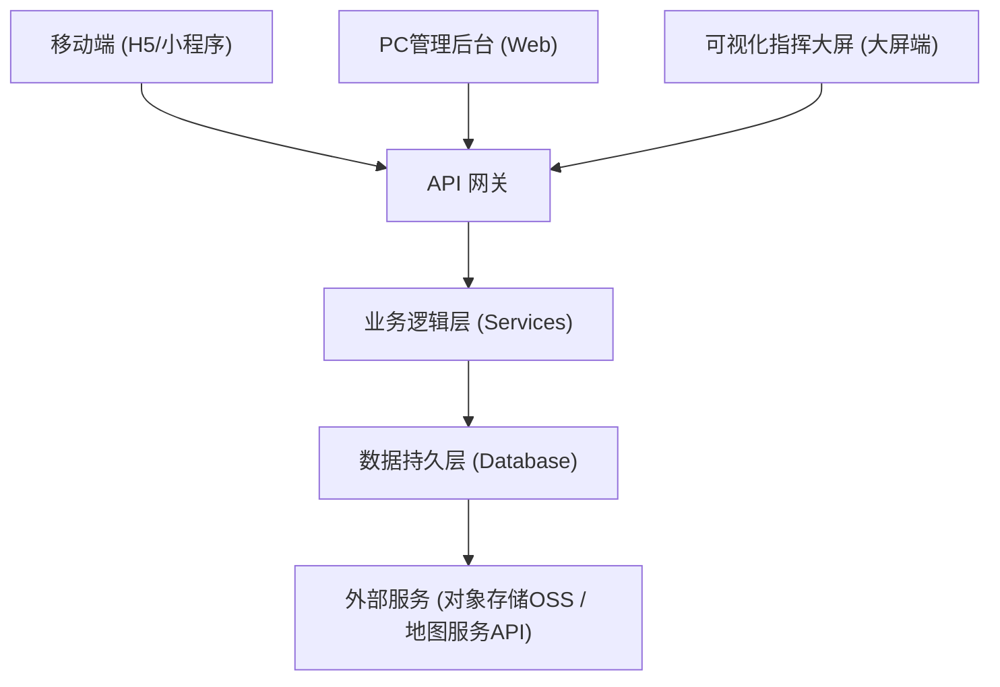
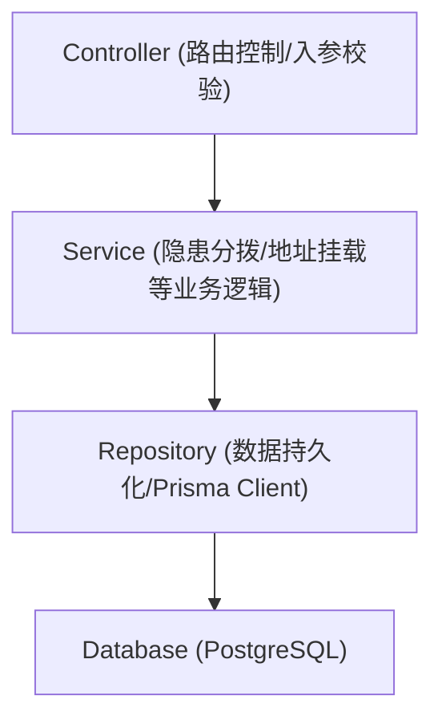
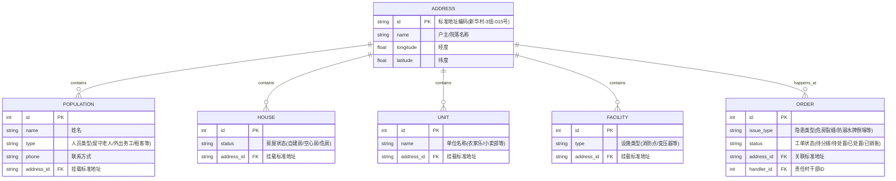

# 农村一标四实系统技术架构文档

## 1. 架构设计


## 2. 技术栈描述
- **前端框架**: React@18 (构建PC后台与大屏) / H5 或 跨平台方案适配移动端
- **UI 组件库**: Ant Design (PC后台), Vant/Ant Design Mobile (移动端)
- **CSS 框架**: TailwindCSS@3
- **地图及可视化**: React-Leaflet / Mapbox GL (2D地图底图挂载), ECharts (数据看板图表)
- **构建工具**: Vite
- **后端 (规划)**: Node.js + Express / NestJS + Prisma ORM
- **数据库**: PostgreSQL (推荐结合 PostGIS 处理农村院落空间地理数据)

## 3. 路由定义 (前端)
| 路由路径 | 用途说明 |
|-------|---------|
| `/` | 默认重定向至PC后台登录页 |
| `/mobile/home` | 移动端：网格员/村干部工作台首页 |
| `/mobile/report` | 移动端：随手拍隐患上报页 (拍照、定位) |
| `/mobile/register` | 移动端：新增返乡人员、留守老人登记表单 |
| `/mobile/tasks` | 移动端：待办工单列表及现场处置结果上传 |
| `/admin/dashboard` | PC端：内勤工作台数据概览 |
| `/admin/address` | PC端：一标 (标准地址/电子门牌) 管理台账 |
| `/admin/population` | PC端：实有人口 (外出务工/留守等) 台账，支持导出 |
| `/admin/house` | PC端：实有房屋 (自住/闲置/危房) 台账，以房查人 |
| `/admin/unit` | PC端：实有单位 (农家乐/快递点) 台账 |
| `/admin/facility` | PC端：实有设施/力量 (变压器/网格员) 台账 |
| `/admin/orders` | PC端：隐患工单分拨、调度与销账中心 |
| `/screen` | 大屏端：可视化指挥全景2D地图与实时预警看板 |

## 4. API 定义 (RESTful)
- `GET /api/address/list`：获取全村标准地址及挂载信息
- `POST /api/orders/report`：移动端提交隐患随手拍
- `GET /api/orders/pending`：PC端获取待分拨隐患工单
- `PUT /api/orders/:id/dispatch`：PC端派单给责任村干部
- `PUT /api/orders/:id/resolve`：移动端提交现场处置结果
- `PUT /api/orders/:id/close`：PC端审核并销账，解除预警

## 5. 服务端架构图


## 6. 数据模型设计

### 6.1 实体关系图 (ER Diagram)


### 6.2 DDL 示例 (部分)
```sql
CREATE TABLE address (
    id VARCHAR(50) PRIMARY KEY COMMENT '标准地址编码',
    name VARCHAR(100) NOT NULL COMMENT '户主/院落名称',
    longitude DECIMAL(10, 6) COMMENT '经度',
    latitude DECIMAL(10, 6) COMMENT '纬度'
);

CREATE TABLE population (
    id SERIAL PRIMARY KEY,
    name VARCHAR(50) NOT NULL,
    type VARCHAR(50) COMMENT '人员类型标签',
    phone VARCHAR(20),
    address_id VARCHAR(50) REFERENCES address(id)
);
```