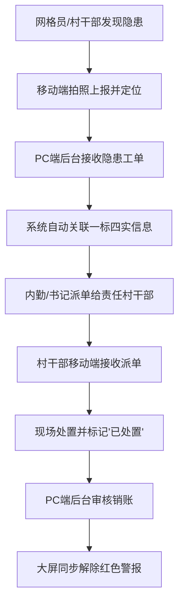

# 农村一标四实系统 PRD

## 1. 产品概述
农村一标四实（标准地址、实有人口、实有房屋、实有单位、实有设施/力量）数字化治理平台。
- 解决农村长期依赖纸质表格管理、底数不清、排查效率低的问题，服务于村委书记、内勤及网格员。
- 减轻基层数据负担，实现“发现-分拨-处置-销账”业务闭环，提升乡村治理的精准化与可视化水平。

## 2. 核心功能

### 2.1 用户角色
| 角色 | 注册/登录方式 | 核心权限 |
|------|---------------------|------------------|
| 村委书记/内勤 | 账号密码登录 | 拥有PC后台及大屏全量数据查看、报表导出、工单分拨权限 |
| 网格员/村干部 | 手机号验证码/微信登录 | 移动端数据采集、随手拍上报、人员核查、工单现场处置 |

### 2.2 功能模块
1. **移动端（微信小程序/H5）**：随手记、随时查、隐患上报、人员信息登记、工单处置。
2. **PC管理后台（电脑网页端）**：数据台账管理、工单分拨调度、一键报表导出、基础设置。
3. **可视化指挥大屏（电视/投影端）**：2D村庄地图总览、人房企物分布热力图、实时隐患预警看板。

### 2.3 页面详情
| 页面名称 | 模块名称 | 功能描述 |
|-----------|-------------|---------------------|
| 移动端-首页 | 快捷工作台 | 大图标入口（随手拍、查人口、查房屋、人员登记） |
| 移动端-随手拍 | 隐患上报 | 支持拍照、自动GPS定位、选择隐患类型（如危房裂缝、防溺水牌倾倒） |
| 移动端-人员登记 | 信息录入 | 录入返乡人员、留守老人儿童等信息，支持标签化管理 |
| 移动端-工单中心 | 待办处置 | 接收派单提醒，上传现场处置照片和结果说明 |
| PC端-数据台账 | 一标四实管理 | 树状结构展示标准地址及挂载的人、房、企、物，支持Excel一键导出 |
| PC端-工单管理 | 隐患分拨 | 接收上报问题，自动关联房屋/人员信息，手动/自动派单给包片村干部 |
| 大屏-全景指挥 | 2D地图可视化 | 以航拍图为底图，展示电子门牌，点击可查信息；同步显示红色隐患警报 |
| 大屏-数据看板 | 统计图表 | 动态展示人口结构（男女比例、外出务工等）、当月排查进度及矛盾纠纷解决率 |

## 3. 核心流程
业务闭环（发现-分拨-处置-销账）流转机制。

## 4. 用户界面设计

### 4.1 设计风格
- **主色调**：
  - 大屏：深邃科技蓝/暗夜黑，凸显数据严肃性与科技感。
  - 移动端/PC后台：清新政务蓝/生态绿，亲和力强，缓解基层工作视觉疲劳。
- **按钮风格**：微圆角，扁平化设计，操作区留白充足。
- **字体及大小**：采用易读的无衬线字体（如 PingFang SC, Microsoft YaHei），移动端字号适当放大，照顾年龄偏大的村干部。
- **布局风格**：
  - PC端：左侧导航树状菜单，右侧宽体数据表格区。
  - 移动端：底部Tab导航，首页采用大色块卡片式布局。
  - 大屏：左右两侧半透明数据面板，中间主视觉为2D村庄地图。

### 4.2 页面设计概览
| 页面名称 | 模块名称 | UI元素设计 |
|-----------|-------------|-------------|
| 移动端首页 | 快捷入口 | 醒目的悬浮“随手拍”按钮，大圆角卡片图标 |
| PC管理后台 | 台账列表 | 紧凑型表格，顶部多条件筛选框，醒目的“一键导出”按钮 |
| 可视化大屏 | 地图与看板 | 动态发光点阵（代表设施/隐患），环形图/柱状图数据可视化组件 |

### 4.3 响应式设计
- **大屏**：固定比例适配（1920x1080及以上），保证图表不变形。
- **PC管理后台**：桌面端优先，流式布局，侧边栏可折叠。
- **移动端**：适配各种尺寸手机屏幕，优化触控体验，防止误触。
