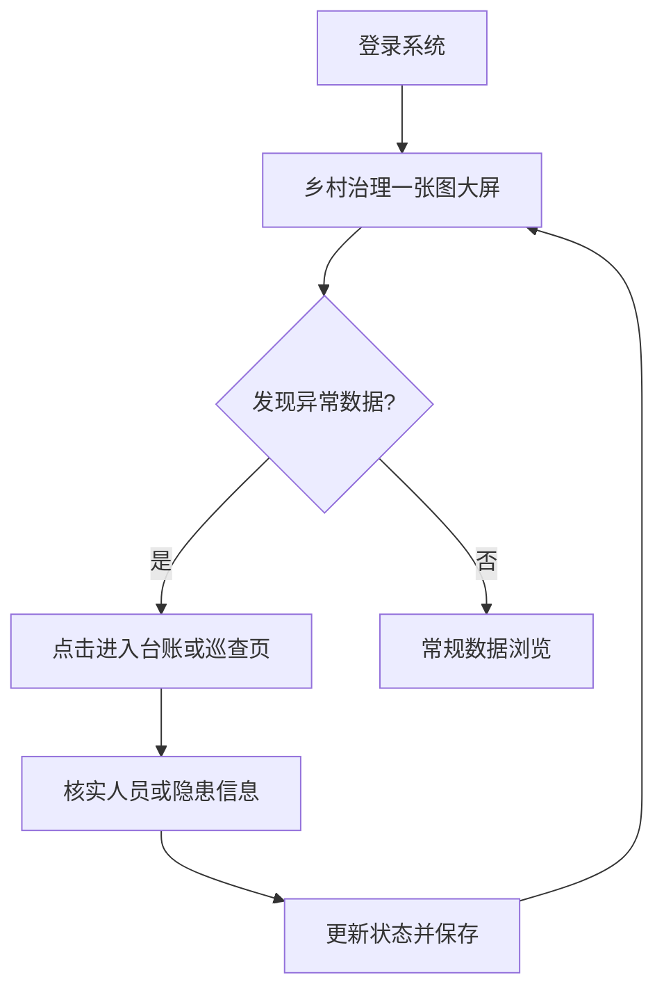

## 1. 产品概述
本项目是一个专为农村基层（如村委）打造的极简版“一标四实”（标准地址、实有人口、实有房屋、实有单位、实有设施）可视化管理平台。
- **主要目的**：解决农村底数不清、手工表格繁杂、缺乏可视化直观展示的问题。
- **目标用户**：村支书、村委干部、网格员。
- **产品价值**：通过数字化手段实现“以房管人、以址查房”，将复杂数据转化为可视化大屏和便捷的移动端巡查清单，极大提升基层治理效率，作为 AI 赋能数字乡村的优秀示范案例。

## 2. 核心功能

### 2.1 用户角色
| 角色 | 注册方式 | 核心权限 |
|------|----------|----------|
| 村委管理员 | 系统预设账号 | 拥有大屏查看、数据分析、隐患台账的全部权限 |

### 2.2 功能模块
1. **乡村治理“一张图”大屏**：全局数据概览、数据可视化图表、预警滚动。
2. **“以房管人”动态台账**：人口与房屋数据联动列表、多维度检索。
3. **掌上巡查管理**：针对小微企业及设施的隐患巡查清单。

### 2.3 页面详情
| 页面名称 | 模块名称 | 功能描述 |
|----------|----------|----------|
| 乡村治理大屏 | 核心指标区 | 动态显示全村总房屋数、总人口数、重点关怀人数（独居老人/留守儿童）、需整改隐患数 |
| 乡村治理大屏 | 人口结构分析 | 以饼图展示常住人口与外出务工人口比例 |
| 乡村治理大屏 | 务工分布统计 | 以柱状图展示各村民小组的外出务工人数分布 |
| 乡村治理大屏 | 隐患预警滚动区 | 滚动展示近期需整改的隐患设施或需要走访的重点关怀人员 |
| 动态台账页 | 房屋人口列表 | 表格形式展示房屋状态、户主及当前居住人员明细，支持按地址/状态筛选 |
| 巡查管理页 | 设施巡查清单 | 极简列表展示重点设施/企业，标识状态（正常/隐患），并支持快速点击更新状态 |

## 3. 核心流程
主要为数据查阅与隐患跟进流程：管理员登录后进入可视化大屏总览全村状况，发现预警项后，可通过台账和巡查列表进行具体定位和状态更新。

## 4. 用户界面设计

### 4.1 设计风格
- **主色调**：深色科技风（深邃蓝、暗紫为主），契合大屏展示需求，高端且专业。
- **辅助色**：使用具有警示和提示意义的颜色（如：危险/隐患用红色，预警/出租用黄色或橙色，正常用绿色或科技蓝）。
- **按钮样式**：微质感带光晕效果，突出科技感和点击欲望。
- **字体与排版**：无衬线字体（如系统默认的现代化无衬线体），数字使用等宽字体以保证大屏数据的整齐与视觉冲击力。大标题加粗加亮。
- **布局风格**：卡片式布局，网格系统，左右对称或黄金分割，确保大屏展示的均衡美。

### 4.2 页面设计概览
| 页面名称 | 模块名称 | UI 元素及交互 |
|----------|----------|---------------|
| 乡村治理大屏 | 顶栏 | 发光大标题、时间实时显示 |
| 乡村治理大屏 | 指标卡片 | 渐变背景、大号发光数字、微小的跳动动画 |
| 乡村治理大屏 | 图表区 | 嵌入 ECharts，深色主题，支持鼠标悬停 tooltip 提示 |
| 乡村治理大屏 | 预警列表 | 列表自动无缝向上滚动，醒目的状态标签 |
| 动态台账页 | 数据表格 | 斑马纹表格、悬浮高亮、状态列使用红/黄/绿 Badge |
| 巡查管理页 | 巡查卡片 | 列表项呈现，操作按钮清晰，状态切换具有过渡动画 |

### 4.3 响应式要求
- 以桌面端（1920x1080）大屏展示为主进行设计。
- 采用自适应布局，确保在不同比例的显示器或投影仪上正常缩放，不出现严重错位。
- 预留部分空间，兼顾在平板等中等屏幕上的基础浏览体验。
