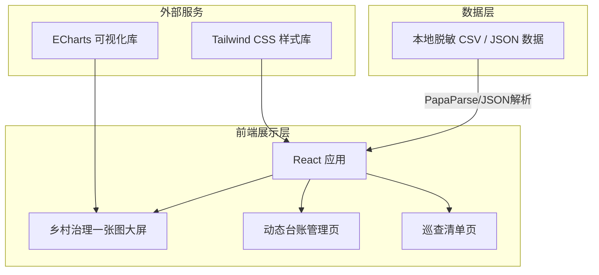

## 1. 架构设计
本项目是一个纯前端的可视化大屏及管理平台，数据基于预先生成的 CSV/JSON 模拟数据，通过前端解析展示，不依赖复杂的后端服务。



## 2. 技术栈说明
- **前端框架**: React@18 + vite
- **样式方案**: tailwindcss@3 + lucide-react (图标)
- **可视化图表**: echarts-for-react + echarts
- **数据处理**: papaparse (如果直接读取刚才生成的 CSV 数据，或者直接转换为本地 JSON 模块)
- **初始化工具**: vite-init

## 3. 路由定义
采用简单的 React Router 或条件渲染进行多页面切换。

| 路由/页面组件 | 用途 |
|---------------|------|
| `/` 或 `Dashboard` | 默认进入乡村治理一张图大屏，展示核心指标与图表 |
| `/ledger` 或 `Ledger` | 动态台账页，以房管人详细列表展示 |
| `/inspection` 或 `Inspection` | 掌上巡查管理页，设施隐患列表 |

## 4. 接口定义
*无独立后端 API，采用本地模拟数据模块。*

定义 TypeScript 类型如下：

```typescript
// 房屋数据类型
export interface HouseData {
  id: string;           // 标准地址编号
  group: string;        // 所属村民小组
  owner: string;        // 房屋所有人
  area: number;         // 建筑面积
  status: '自住' | '空置' | '危房' | '出租';
  structure: string;    // 建筑结构
}

// 人口数据类型
export interface PopulationData {
  name: string;         // 姓名
  gender: string;       // 性别
  age: number;          // 年龄
  idCard: string;       // 脱敏身份证号
  phone: string;        // 联系电话
  houseId: string;      // 居住地址编号
  label: '常住村民' | '外出务工' | '独居老人' | '外来人口' | '五保户' | '留守儿童' | '村干部/网格员';
  healthStatus: string; // 健康状况
}

// 设施单位数据类型
export interface FacilityData {
  name: string;         // 名称
  category: string;     // 类别
  id: string;           // 标准地址编号
  manager: string;      // 负责人
  phone: string;        // 联系电话
  status: '正常' | '需整改' | '需清理';
  issueDesc: string;    // 隐患描述
}
```

## 5. 数据流向与状态管理
- 将预先生成的 `mock_house.csv`, `mock_population.csv`, `mock_facility.csv` 内容转换为 JSON 常量存储在前端代码中。
- 大屏加载时，进行简单的数据计算：
  1. 计算总人口数、总房屋数。
  2. 根据 `label` 筛选出独居老人和留守儿童。
  3. 统计各组的务工人数（过滤 `label === '外出务工'`）。
  4. 筛选出 `status !== '正常'` 的设施作为预警列表。
- 页面切换使用简单的状态 `activeTab`，保证操作的流畅性，无需复杂配置。
