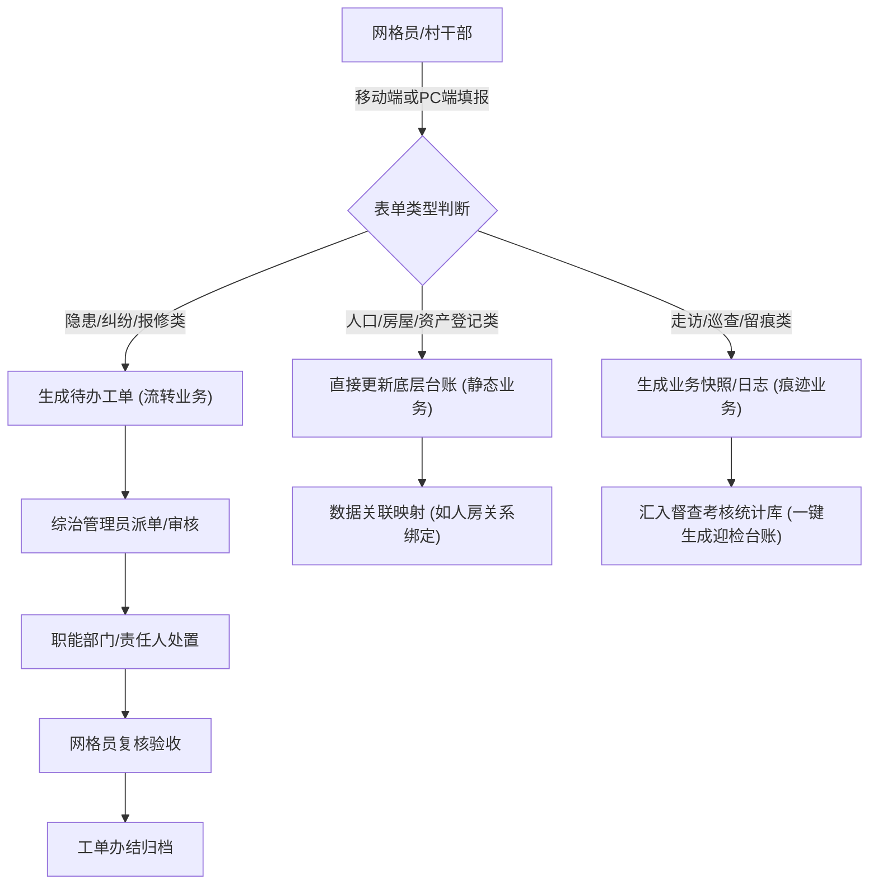

# 基层治理表单系统 PRD

## 1. 产品概述
本系统是基于“一标四实”数据底座的基层治理表单采集与流转系统，旨在将传统的纸质台账数字化。
核心目标是打通矛盾化解、经济动员、人口服务、空间治理和行政督查五大业务场景，通过结构化表单减轻网格员填报负担，实现数据的“最多录一次”和“全网互通”。

## 2. 核心功能

### 2.1 用户角色
| 角色 | 注册方式 | 核心权限 |
|------|----------|----------|
| 网格员/村干部 | 后台分配 | 表单数据采集、隐患上报、日常走访登记 |
| 综治管理员 | 后台分配 | 台账审核、工单派发、数据导出与报表生成 |
| 镇街领导 | 后台分配 | 全局数据概览、高危事件督办、统计分析查看 |

### 2.2 功能模块
1. **矛盾化解与社会维稳模块**：纠纷排查调处、重点人员动态管控、突发事件上报。
2. **经济动员与资产管理模块**：招商项目跟踪、村集体三资登记、惠农资金发放。
3. **人口管理与民生服务模块**：流动人口登记、弱势群体关爱、育龄妇女摸排。
4. **空间治理与基础设施模块**：实有房屋安全巡检、安防设施维保。
5. **行政督查与痕迹管理模块**：交办事项跟踪、专项整治巡查、会议活动留痕。

### 2.3 页面详情

#### 2.3.1 矛盾化解与社会维稳类
| 页面名称 | 模块名称 | 功能描述 |
|----------|----------|----------|
| **矛盾纠纷调处台账** | 列表与筛选 | 筛选：纠纷类型、调解状态、发生时间区间。 列表：展示涉事方、纠纷类型、调解人、状态。 扩展：批量导出 Excel，一键生成调解书快照。 |
| | 新增/编辑表单 | 字段：纠纷类型 (枚举：地界林权/婚姻家庭/劳资纠纷/邻里建房)、涉事多方 (多选关联人口库)、核心诉求 (多行文本)、调解方案 (多行文本)、调解人 (关联系统用户)、调解状态 (枚举：待调解/调解中/已化解/已上交)、达成协议附件 (文件/图片上传)。 |
| **重点人员管控台账** | 列表与筛选 | 筛选：人员分类、风险等级、包保干部。 列表：展示人员基本信息、风险等级（高亮红/黄/绿）、最近走访时间。 扩展：点击查看历史走访时间线。 |
| | 走访登记表单 | 字段：帮扶对象 (只读，关联人口)、人员分类 (枚举：信访老户/刑释人员/易肇事精神障碍/吸毒人员)、近期思想动态 (多行文本)、本次走访时间 (日期时间)、包保干部 (关联用户)、风险评估等级 (枚举：高风险/中风险/低风险/已降级)。 |
| **突发事件首报单** | 瀑布流/列表 | 筛选：事件来源、发生日期。 列表：以图文卡片或列表形式展示突发事件，支持快速派单。 扩展：地图轨迹定位展示。 |
| | 上报表单 | 字段：发现时间 (日期时间)、发生地点 (关联标准地址或输入经纬度)、事件描述 (多行文本)、现场照片/视频 (多媒体上传)、初步控制措施 (多行文本)。 |

#### 2.3.2 经济动员与资产管理类
| 页面名称 | 模块名称 | 功能描述 |
|----------|----------|----------|
| **招商项目跟踪台账** | 列表与看板 | 筛选：项目阶段、包保领导。 展示：可切换表格视图和看板 (Kanban) 视图（按进度分列）。 扩展：导出项目进度汇报表。 |
| | 项目登记表单 | 字段：意向企业名称 (文本)、拟投资额 (数字，万元)、用地需求面积 (数字，亩)、当前洽谈进度 (枚举：初步对接/实地考察/协议拟定/签约落地/流产)、存在困难 (多行文本)、包保领导 (关联用户)。 |
| **村集体三资台账** | 列表与统计 | 筛选：资产类型、当前状态。 展示：顶部带统计卡片（总资产、闲置率等），下方为资产明细表。 扩展：租金到期自动预警红标。 |
| | 资产登记表单 | 字段：资产类型 (枚举：林地/旧厂房/闲置宅基地/商铺)、面积或数量 (数字)、当前状态 (枚举：闲置/已出租/自用)、承租人 (关联人口或企业)、合同起止时间 (日期区间)、年收益金额 (数字)。 |
| **惠农资金发放册** | 列表与导入 | 筛选：补贴项目、发放批次。 功能：支持 Excel 模板下载与批量导入发放名单，支持核对导出。 |
| | 发放明细表单 | 字段：户主姓名 (关联人口)、身份证号 (自动带出只读)、补贴项目 (枚举：种粮补贴/农机补贴/低保金/危房改造补等)、核定面积或数量 (数字)、应发金额 (数字计算)、银行账号 (文本)。 |

#### 2.3.3 人口管理与民生服务类
| 页面名称 | 模块名称 | 功能描述 |
|----------|----------|----------|
| **流动人口登记册** | 列表与查询 | 筛选：流入地、暂住事由、到期时间。 扩展：居住证即将到期自动预警，支持关联打印居住凭证。 |
| | 登记表单 | 字段：承租人 (关联人口库)、流入地 (省市区三级联动选择)、暂住事由 (枚举：务工/经商/探亲/就学)、预计居住期限 (日期区间)、房东信息 (关联实有房屋)、就业单位 (关联实有单位)。 |
| **弱势群体关爱台账** | 列表与走访 | 筛选：帮扶类型、健康状况。 展示：一页一档，支持快速添加走访记录。 |
| | 关爱走访表单 | 字段：帮扶对象 (关联特殊人口)、帮扶类型 (枚举：留守儿童/孤寡老人/残疾人/特困户)、健康状况评估 (枚举：良好/一般/需就医)、居住环境安全评估 (枚举：安全/存在隐患)、本次发放物资 (文本)、代办事项记录 (多行文本)。 |
| **育龄妇女摸排表** | 列表与统计 | 筛选：婚姻状态、生育意愿。 扩展：按网格统计生育意向报表。 |
| | 摸排登记表单 | 字段：对象姓名 (关联人口)、婚姻状态 (枚举：未婚/初婚/离异/丧偶)、现有子女数 (数字)、生育意愿调查 (枚举：愿意/暂不考虑/不愿生育)、母婴保健服务发放记录 (多行文本)。 |

#### 2.3.4 空间治理与基础设施类
| 页面名称 | 模块名称 | 功能描述 |
|----------|----------|----------|
| **房屋隐患巡检台账** | 列表与地图 | 筛选：使用性质、隐患类型、整改状态。 展示：支持列表模式与 GIS 地图散点图模式切换。 |
| | 巡检登记表单 | 字段：房屋编号 (关联标准地址)、建筑结构 (枚举：砖木/混砖/钢混/土木)、使用性质 (枚举：自住/群租房/商用/厂房)、隐患类型 (多选枚举：违规隔断/私拉电线/墙体开裂/消防通道堵塞/无)、整改期限 (日期)、整改状态 (枚举：未整改/整改中/已验收)。 |
| **安防设施维保台账** | 列表与报修 | 筛选：设施类型、运行状态。 扩展：扫设备二维码快速带出报修表单。 |
| | 维保报修表单 | 字段：设施编号 (关联实有设施)、设施类型 (自动带出：监控/微型消防站等)、当前运行状态 (枚举：正常/轻微损坏/完全瘫痪)、报修故障描述 (多行文本)、现场照片 (图片上传)、维保责任人 (关联用户)、处理结果 (多行文本)。 |

#### 2.3.5 行政督查与痕迹管理类
| 页面名称 | 模块名称 | 功能描述 |
|----------|----------|----------|
| **上级交办事项台账** | 看板与督办 | 筛选：交办来源、办理状态。 展示：看板 (Kanban) 拖拽式管理（待接收/办理中/待审核/已办结）。 扩展：即将逾期任务变黄，逾期变红，支持下发督办单。 |
| | 办理反馈表单 | 字段：交办来源 (枚举：市长热线/县纪委/镇综治办/信访局)、事项简述 (文本)、要求办结时间 (日期时间)、实际办结时间 (日期时间)、办理节点记录 (动态增删表单项：时间+动作)、办结报告或佐证文件 (文件上传)。 |
| **专项整治巡查台账** | 列表与对比 | 筛选：专项任务名称、巡查责任人。 展示：重点突出整改前/整改后的对比照片墙视图。 |
| | 巡查填报表单 | 字段：专项任务名称 (枚举：秸秆禁烧/黑臭水体/违建拆除/人居环境)、巡查点位 (GPS定位或关联标准地址)、发现问题 (多行文本)、整改前照片 (图片上传)、整改后复核照片 (图片上传)、整改责任人 (关联用户)。 |
| **会议与活动留痕库** | 照片墙与列表 | 筛选：活动主题、开展年份。 功能：为应付各类检查提供一键打包下载“迎检台账”功能（导出含图文的 PDF）。 |
| | 留痕登记表单 | 字段：活动主题 (枚举：党建学习/普法宣传/安全教育/村委换届等)、开展时间 (日期时间)、开展地点 (文本)、参与人数 (数字)、现场签到表照片 (图片上传)、活动现场横幅/场景照片 (多图上传)、会议纪要 (富文本)。 |

## 3. 核心流程
主要描述表单数据的“采集 - 流转 - 审核/归档”闭环流程。

## 4. 用户界面设计
### 4.1 设计风格
- **主色调**：政务蓝 (`#1D39C4`)，代表权威与严谨。
- **辅助色**：警示红 (`#CF1322`) 用于高危隐患与逾期，安全绿 (`#389E0D`) 用于已化解/正常状态，警告黄 (`#FAAD14`) 用于即将逾期或中风险。
- **按钮与组件**：采用小圆角 (`2px` - `4px`)，摒弃过度圆润的互联网风格；按钮采用扁平化、无多余投影的实心设计。
- **字体**：系统默认无衬线字体，表单标题与数据概览的数字采用加粗的等宽字体（如 `DIN Alternate` 或 `Oswald`）以增强公文报表的专业感。
- **布局风格**：采用经典的左右结构（左侧深色政务蓝菜单导航，右侧浅灰色 `#F4F6F8` 内容区），表单页采用“顶部卡片概览 + 底部多标签页（Tabs）或锚点滚动的长表单”设计。

### 4.2 页面设计概览
| 页面类型 | 核心模块 | UI 元素规范 |
|----------|----------|-------------|
| **各类台账列表页** | 顶部搜索区 | 紧凑型多条件筛选表单，带展开/收起功能，主要操作按钮（新增、导出、批量操作）统一居右排列。 |
| | 数据表格区 | 带有硬朗实线边框的 Table (`bordered`)，表头带有浅灰色背景，支持列宽拖拽、首尾列固定（操作列固定在最右）。 |
| | 批量操作区 | 选中多行后，底部或表格顶部浮现批量操作条（如批量导出、批量指派包保干部）。 |
| **各类新增/编辑表单页**| 表单容器 | 以右侧抽屉 (Drawer) 或居中模态框 (Modal) 为主，超过 15 个字段的复杂表单新开全屏页面；白色背景卡片包裹，带极简小阴影。 |
| | 字段布局 | 采用双列或三列网格布局，标签（Label）右对齐，必填项带红色星号。枚举类优先使用 Select 下拉框，少于 3 个选项的使用 Radio 单选框。 |
| | 附件上传区 | 支持拖拽上传区域，已传图片支持缩略图九宫格预览及点击放大（Lightbox）。 |

### 4.3 响应式要求
- **桌面端优先 (Desktop-first)**：针对 `1024px` 及以上分辨率进行极致的表格与复杂表单优化，保证同屏信息密度，满足内勤人员的案头办公需求。
- **移动端适配**：针对网格员现场采集场景，所有“新增/登记”类表单必须自适应至单列布局，输入框尺寸增大（高度 `44px` 以上）以适应触控，上传组件深度集成手机原生摄像头与相册调用。