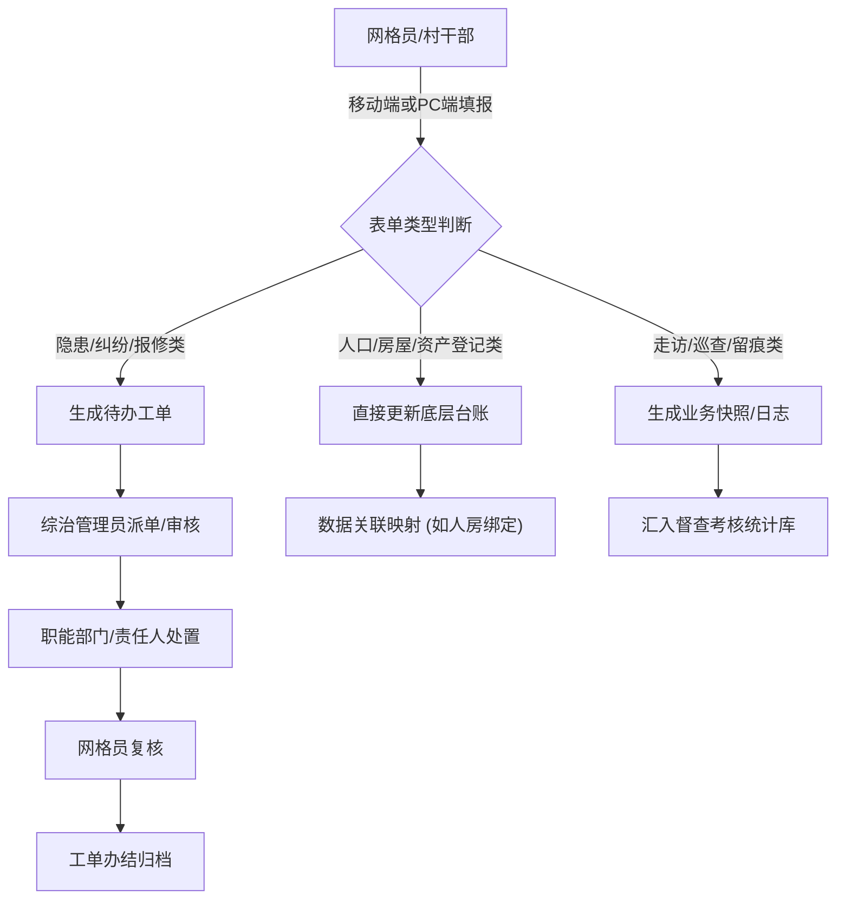

# 基层治理表单系统 PRD

## 1. 产品概述
本系统是基于“一标四实”数据底座的基层治理表单采集与流转系统，旨在将传统的纸质台账数字化。
核心目标是打通矛盾化解、经济动员、人口服务、空间治理和行政督查五大业务场景，通过结构化表单减轻网格员填报负担，实现数据的“最多录一次”和“全网互通”。

## 2. 核心功能

### 2.1 用户角色
| 角色 | 注册方式 | 核心权限 |
|------|----------|----------|
| 网格员/村干部 | 后台分配 | 表单数据采集、隐患上报、日常走访登记 |
| 综治管理员 | 后台分配 | 台账审核、工单派发、数据导出与报表生成 |
| 镇街领导 | 后台分配 | 全局数据概览、高危事件督办、统计分析查看 |

### 2.2 功能模块
1. **矛盾维稳模块**：纠纷排查、重点人员管控、隐患上报。
2. **经济资产模块**：招商项目跟踪、村集体三资管理、惠农资金发放。
3. **人口民生模块**：流动人口登记、弱势群体关爱、育龄妇女摸排。
4. **空间设施模块**：房屋安全巡检、安防设施维保。
5. **行政督查模块**：交办事项跟踪、专项整治巡查、会议活动留痕。

### 2.3 页面详情
| 页面名称 | 模块名称 | 功能描述 |
|----------|----------|----------|
| **矛盾纠纷台账页** | 列表与筛选 | 支持按纠纷类型、状态、发生时间筛选；支持分页和导出 |
| | 新增/编辑表单 | 字段：纠纷类型(枚举:地界/婚姻/劳资等)、涉事方(多选关联人口)、诉求文本、调解方案、调解状态(枚举:待调解/调解中/已化解)、协议附件(文件上传) |
| **重点人员管控页** | 列表与筛选 | 按人员分类、风险等级筛选；支持高危人员标红高亮 |
| | 走访登记表单 | 字段：人员ID(只读关联)、近期动态(文本)、本次走访时间(日期)、管控责任人(单选)、风险评估(枚举:高/中/低) |
| **隐患首报单页** | 列表与详情 | 隐患事件的瀑布流展示，支持图文混排预览 |
| | 上报表单 | 字段：发现时间(默认当前)、发生地点(关联标准地址)、事件描述(多行文本)、现场照片(多图上传)、初步控制措施 |
| **三资管理台账页** | 列表与统计 | 展示资产列表，顶部附带资产总数、闲置率等统计卡片 |
| | 资产登记表单 | 字段：资产类型(枚举:林地/厂房/宅基地)、面积(数字)、当前状态(枚举:闲置/出租)、承租人(关联人口/单位)、起止时间(日期区间)、年收益(数字) |
| **惠农资金花名册** | 列表与导入导出 | 支持按补贴项目筛选，支持Excel批量导入发放名单 |
| | 发放明细表单 | 字段：户主(关联人口)、身份证号(自动带出)、补贴项目(枚举:粮补/农机补等)、核定数量(数字)、应发金额(数字计算)、银行账号(文本) |
| **流动人口登记页** | 列表与查询 | 支持按流入地、居住期限快速检索 |
| | 登记表单 | 字段：承租人(关联人口)、流入地(省市区级联选择)、暂住事由(枚举:务工/探亲等)、预计期限(日期区间)、房东(关联房屋)、就业单位(关联单位) |
| **弱势群体关爱页** | 列表与跟进 | 展示帮扶对象列表，支持一键记录走访 |
| | 关爱走访表单 | 字段：帮扶对象(关联特殊人口)、健康评估(枚举:良好/一般/较差)、安全评估(枚举:安全/隐患)、发放物资(文本)、代办事项(多行文本) |
| **房屋安全巡检页** | 列表与地图视图 | 列表展示房屋隐患，支持切换至地图打点视图 |
| | 巡检表单 | 字段：房屋编号(关联地址)、建筑结构(枚举:砖木/混砖等)、使用性质(枚举:自住/出租/商用)、隐患类型(多选枚举:违规隔断/私拉电线/墙体开裂)、整改期限(日期) |
| **安防设施维保页** | 列表与报修 | 展示设施清单，支持状态快速过滤（正常/损坏） |
| | 维保记录表单 | 字段：设施编号(关联设施)、运行状态(枚举:正常/损坏/维修中)、报修描述(文本)、维保责任人(关联系统用户)、处理结果(多行文本) |
| **交办事项跟踪页** | 任务看板 | 采用看板(Kanban)形式展示待办、处理中、已办结的任务 |
| | 办理反馈表单 | 字段：交办来源(只读)、要求办结时间(只读)、实际办结时间(日期)、办理节点(动态增删项)、办结报告(富文本/文件上传) |
| **专项整治巡查页** | 列表与对比 | 展示巡查记录，重点突出整改前后的图片对比 |
| | 巡查填报表单 | 字段：任务名称(枚举:秸秆禁烧/黑臭水体等)、巡查点位(定位/关联地址)、发现问题(文本)、整改前照片(上传)、整改后照片(上传)、整改责任人 |

## 3. 核心流程
主要描述表单数据的“采集 - 流转 - 审核/归档”闭环流程。

## 4. 用户界面设计
### 4.1 设计风格
- **主色调**：政务蓝 (`#1D39C4`)，代表权威与严谨。
- **辅助色**：警示红 (`#CF1322`) 用于高危隐患，安全绿 (`#389E0D`) 用于已化解/正常状态。
- **按钮与组件**：采用小圆角 (`2px` - `4px`)，摒弃过度圆润的互联网风格；按钮采用扁平化、无多余投影的实心设计。
- **字体**：系统默认无衬线字体，表单标题与数据概览的数字采用加粗的等宽字体（如 `DIN Alternate`）以增强专业感。
- **布局风格**：采用经典的左右结构（左侧深色菜单导航，右侧浅色内容区），表单页采用顶部卡片信息+底部多标签页（Tabs）或锚点滚动的长表单设计。

### 4.2 页面设计概览
| 页面名称 | 模块名称 | UI 元素规范 |
|----------|----------|-------------|
| **各类台账列表页** | 顶部搜索区 | 紧凑型多条件筛选表单，带展开/收起功能，主要操作按钮（新增、导出）居右 |
| | 数据表格区 | 带有硬朗实线边框的 Table (`bordered`)，表头带有浅灰色背景，支持列宽拖拽、固定操作列 |
| | 批量操作区 | 选中行后底部浮现批量操作条（如批量导出、批量指派） |
| **各类新增/编辑表单页**| 表单容器 | 以抽屉 (Drawer) 或全屏模态框 (Modal) 为主，复杂表单新开页面；白色背景卡片包裹 |
| | 字段布局 | 采用双列或三列网格布局，标签（Label）右对齐或顶对齐，必填项带红色星号 |
| | 附件上传区 | 支持拖拽上传区域，已传图片支持缩略图九宫格预览及点击放大 |

### 4.3 响应式要求
- **桌面端优先 (Desktop-first)**：针对 `1024px` 及以上分辨率进行极致的表格与复杂表单优化，保证同屏信息密度。
- **移动端适配**：针对网格员现场采集场景，所有“新增/登记”类表单必须自适应至单列布局，输入框尺寸增大以适应触控，上传组件支持直接调用手机摄像头。